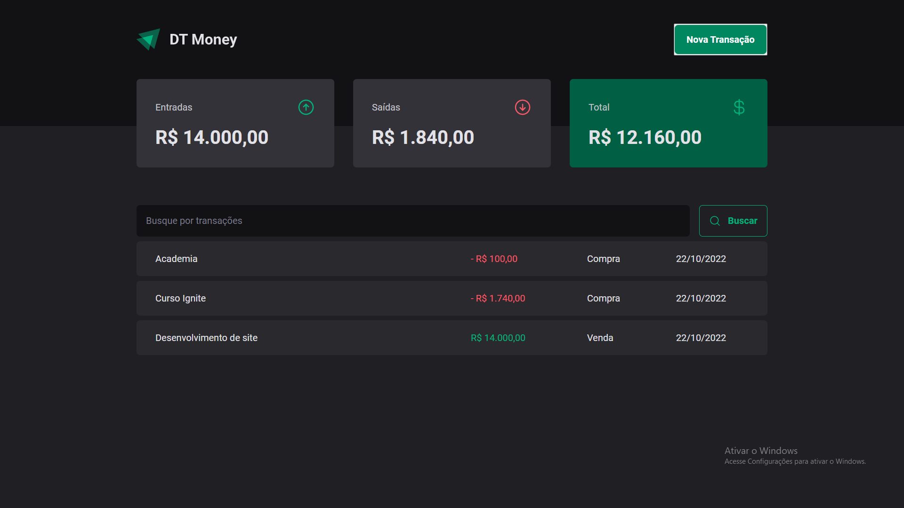
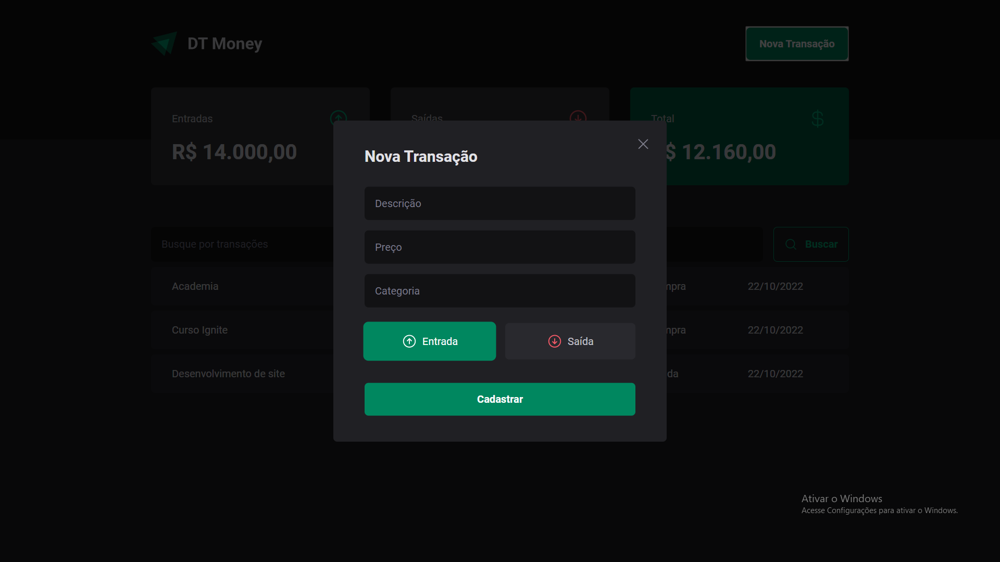

# DT-Money

Aplicação de controle financeiro desenvolvida no módulo: Consumo de API e performance no ReactJS do Ignite

* Cria e registra as transações de entrada e saida financeiro

### Desenvolvimento
*   React-Typescript
*   [phosphor-icon](https://phosphoricons.com/)
*   [Radix-ui](https://www.radix-ui.com/docs/primitives/overview/introduction)
*   [Styled-components](https://styled-components.com/)
*   [Json-server](https://github.com/typicode/json-server)
*   [React-Hook-Form](https://react-hook-form.com/)
*   [Zod](https://zod.dev/)
*   [Axios](https://axios-http.com/ptbr/docs/intro)
*   [use-context-selector](https://github.com/dai-shi/use-context-selector)

--------------

### Imagens






### Executando Localmente
1. Primeiro passo
```
git clone https://github.com/Drlazinho/dt-money.git
```
2. Em seguida entre no diretório usando o terminal
```
cd dt-money
```
3. Depois de selecionado o diretório digite no terminal.
```
yarn install

or 

npm install
```
5. Execute o comando pra conectar o server. Sem o server a aplicação não funcionará corretamente
````
yarn dev:server

or

npm run dev:server
````

4. Abre um novo terminal no mesmo diretório do projeto, e execute um dos seguintes commandos, que deve ter a mesma primeira palavra chave do comando anterior.
````
yarn dev

or

npm run dev
````

Ele vai disponibilizar um link localhost, clica nesse link e testa.
